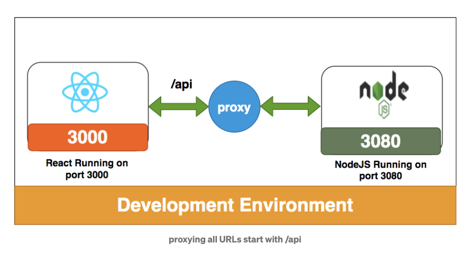
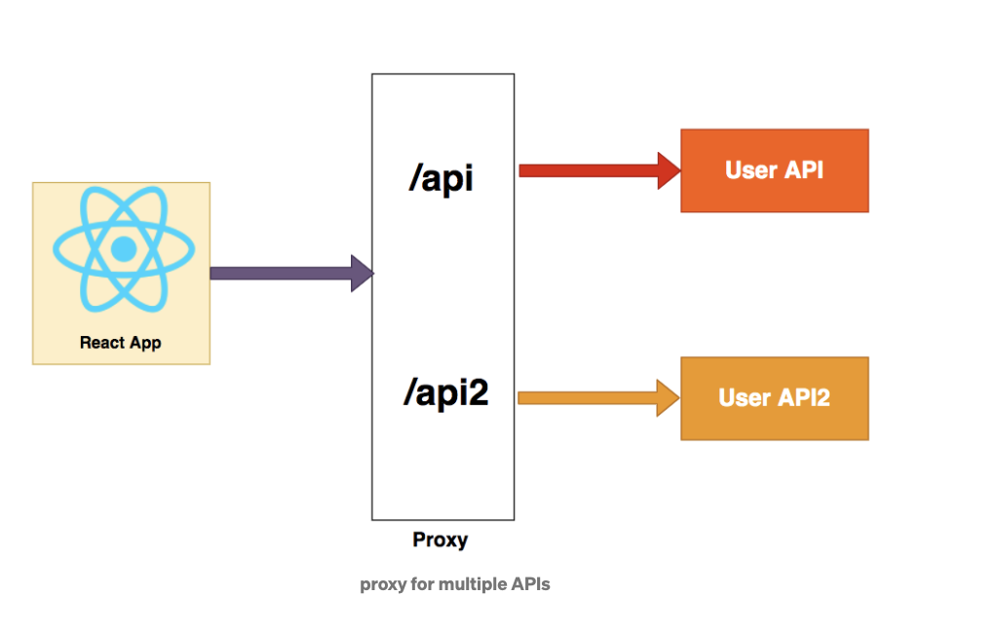

react-proxy-example
This is an example project on how to proxy to backend servers in React Applications

## What is proxying

In general, A proxy or proxy server serves as a gateway between your app and the internet.
It’s an intermediate server between client and servers by forwarding client requests to resources.
Whatever the deployment method we use we have to use proxy in the development environment.
We often talk to backend servers in the development phase

