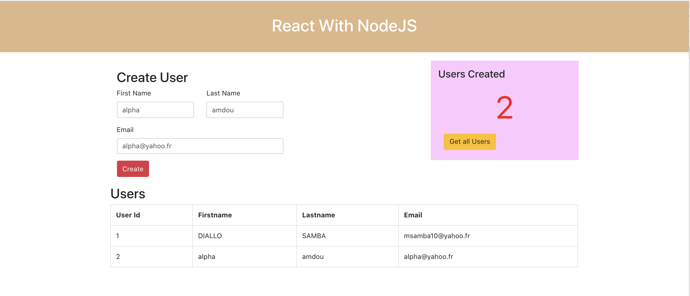

react-proxy-example
This is an example project on how to proxy to backend servers in React Applications

## What is proxying

In general, A proxy or proxy server serves as a gateway between your app and the internet.
It’s an intermediate server between client and servers by forwarding client requests to resources.
Whatever the deployment method we use we have to use proxy in the development environment.
We often talk to backend servers in the development phase

Proxy Setup with Create React App :   "proxy": "http://localhost:3080",
Setting up proxying into the backend server with Create React App is straight forward and easy.
To tell the development server to proxy any unknown requests to your API server in development, add a proxy field to your (web app) package.json
"proxy": "http://localhost:3080"

{
  "name": "my-app",
  "version": "0.1.0",
  "private": true,
  "dependencies": {
    "@testing-library/jest-dom": "^4.2.4",
    "@testing-library/react": "^9.5.0",
    "@testing-library/user-event": "^7.2.1",
    "bootstrap": "^4.5.0",
    "react": "^16.13.1",
    "react-bootstrap": "^1.0.1",
    "react-dom": "^16.13.1",
    "react-scripts": "3.4.1"
  },
  "scripts": {
    "start": "react-scripts start",
    "build": "react-scripts build",
    "test": "react-scripts test",
    "eject": "react-scripts eject"
  },
  "proxy": "http://localhost:3080",
}

Manual Proxy Setup
Sometimes this simple proxy setup is not flexible enough for you. For that, we have to do the manual setup.
We need to install http-proxy-middleware in the React UI.
npm install http-proxy-middleware --save

We need to add this file called setupProxy.js under the src folder of the React App.
You do not need to import this file anywhere. It is automatically registered when you start the development server.

How To Proxy to Multiple APIs
We have seen how we can proxy into one API from your React UI. This is not the case most of the time.
Your React app might need to call multiple APIs to get the data. Let’s see how we can do that.
For example, if you look at the below diagram the Reac UI is calling two APIs: api and api2.
All the calls that start with /api should be redirected to User API and all the calls that start
with the /api2 should be redirected to User API2.
We can implement this scenario with the setupProxy.js. I have added one more API with the context 
path api2 and we need to add one more middleware entry as shown in the setupProxy.js file.

